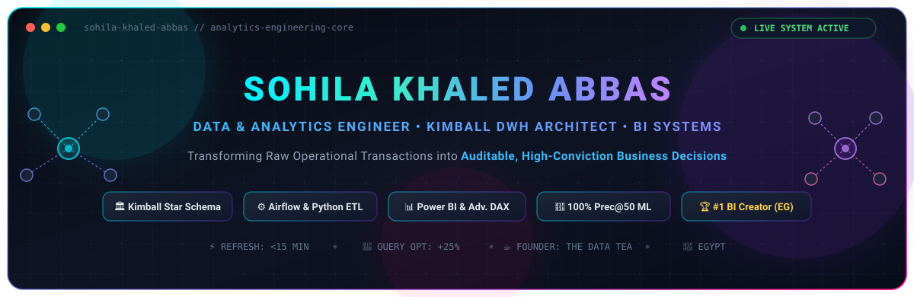
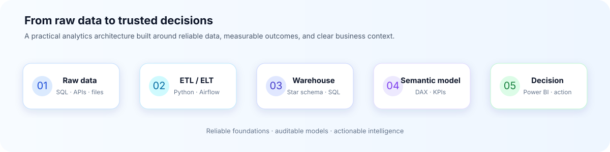
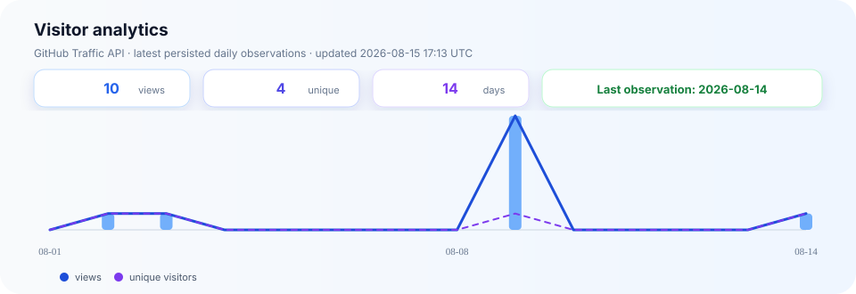

<picture>
  <source media="(prefers-color-scheme: dark)" srcset="./assets/header.svg" />
  <source media="(prefers-color-scheme: light)" srcset="./assets/header.svg" />
  
</picture>

# Sohila Khaled Abbas

### Data Analyst · BI Developer · Data Engineering Enthusiast

  
  
  

  
  

> I turn operational data into clear, auditable decisions through reliable pipelines, dimensional models, and practical business intelligence.

## Currently working on

- Building and refining **Power BI analytics solutions** for sales, HR, and operational reporting, with a focus on actionable KPIs and DAX-driven models.
- Strengthening my **analytics engineering toolkit** through dbt study notes, dimensional modeling, SQL optimization, and repeatable transformation patterns.
- Developing reliable **Python and SQL ETL workflows** for API integration, data validation, PostgreSQL warehousing, and decision-ready reporting.
- Supporting aspiring data professionals through **technical coaching, reusable BI templates, and code reviews**.

## About

I am a data professional based in **Damietta, Egypt**, focused on building analytics solutions that connect sound data architecture with measurable business outcomes. My work spans **Power BI, SQL, Python, ETL automation, data warehousing, and statistical analysis**.

I enjoy simplifying complex workflows, improving reporting reliability, and helping aspiring analysts build production-ready technical habits through coaching and code review.

## Analytics architecture

<picture>
  <source media="(prefers-color-scheme: dark)" srcset="./assets/analytics-pipeline-dark.svg" />
  <source media="(prefers-color-scheme: light)" srcset="./assets/analytics-pipeline-light.svg" />
  
</picture>

## What I do

<strong>Business intelligence</strong>

Build executive-ready Power BI dashboards, KPI models, and DAX measures that support faster decisions.

<strong>Data engineering</strong>

Design Python/SQL pipelines, REST API integrations, and PostgreSQL warehouses for dependable analytics.

<strong>Data modeling</strong>

Apply Kimball principles, star schemas, indexing, partitioning, and slowly changing dimensions.

<strong>Analytics enablement</strong>

Coach data practitioners through reusable templates, technical reviews, and practical BI scenarios.

## Selected work

<strong>Featured projects</strong>

- [**DeepClean OS**](https://github.com/Sohila-Khaled-Abbas/deep-clean-data-tool) — Streamlit data preparation with Python, Pandas, and scikit-learn.
- [**B2B Retail Analytics & Churn**](https://github.com/Sohila-Khaled-Abbas/fmcg-sales-churn-drop-analysis-powerbi) — Power BI diagnostics, DAX, and star-schema modeling.
- [**SMART Supply Chain Insights**](https://github.com/Sohila-Khaled-Abbas/SMART-Supply-Chain-Insights-Dashboard) — Statistical analysis and Power BI visualization for operational risk.
- [**Customer 360 Banking ETL**](https://github.com/Sohila-Khaled-Abbas/customer-360-banking-etl) — Warehouse-oriented customer and banking data integration.
- [**The Data Tea**](https://github.com/Sohila-Khaled-Abbas/the-data-tea) — A practical data-learning and career platform.

## Tech stack

  
  
  
  
  
  
  
  

  
  
  
  
  
  
  

## Experience highlights

- Built **10+ interactive Power BI dashboards** using dimensional modeling and advanced DAX.
- Reduced reporting refresh cycles from days to **under 15 minutes** in client analytics workflows.
- Automated ETL processes that removed approximately **40 hours of manual work per client**.
- Reduced query execution time by **25%** across 10 GB retail datasets through indexing, partitioning, and T-SQL refactoring.
- Conducted **100+ technical code reviews** and supported **50+ trainees** through reusable BI and analytics templates.

## GitHub activity

  <picture>
    <source media="(prefers-color-scheme: dark)" srcset="./assets/metrics.svg" />
    <source media="(prefers-color-scheme: light)" srcset="./assets/metrics.svg" />
    
  </picture>

<strong>Contribution animation</strong>

<picture>
  <source media="(prefers-color-scheme: dark)" srcset="./assets/github-snake-dark.svg" />
  <source media="(prefers-color-scheme: light)" srcset="./assets/github-snake.svg" />
  
</picture>

<strong>Visitor analytics</strong>

Daily observations are collected from the GitHub Traffic API and persisted in the repository. Click the chart to view the refresh workflow.

## Credentials

- **B.Sc. in Agricultural Sciences**, Damietta University, 2024
- DataCamp Data Analyst / Scientist / Engineer Associate and Data Literacy certificates
- Cisco Data Analytics Essentials
- HackerRank SQL and Python certificates
- Training in data warehousing, Apache Airflow, dbt, Excel VBA, cloud data engineering, and AI fluency

## Let’s connect

I am open to conversations about **data analysis, business intelligence, analytics engineering, ETL automation, data warehousing, and technical coaching**.

<picture>
  <source media="(prefers-color-scheme: dark)" srcset="./assets/footer.svg" />
  <source media="(prefers-color-scheme: light)" srcset="./assets/footer.svg" />
  
</picture>

